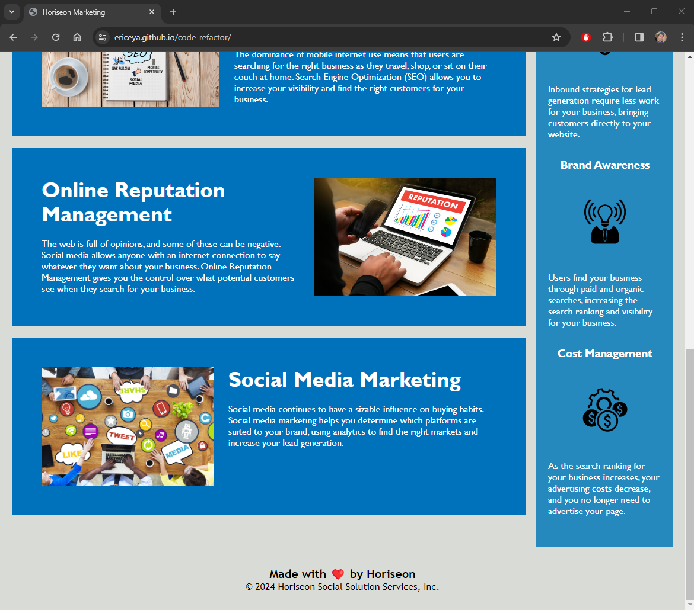

## Code Refactoring &mdash; Horiseon webpage

The starter code consist of many tags and elements that are not so accessible or readable.

- As a junior developer, 
- I want to refactor the code with better semantics
- so that it is easier to read for all people and for online search engine optimization.

> Semantics is very crucial when writing HTML code for website for public access. For those with vision or hearing impaired, good semantics make the website much more easier to comprehend and navigate.

## How the page should look

> The above shows how the webpage should look when the starting code is not broken.

## Screenshot of the refactored webpage

## Link to deploy

[https://ericeya.github.io/code-refactor](https://ericeya.github.io/code-refactor)